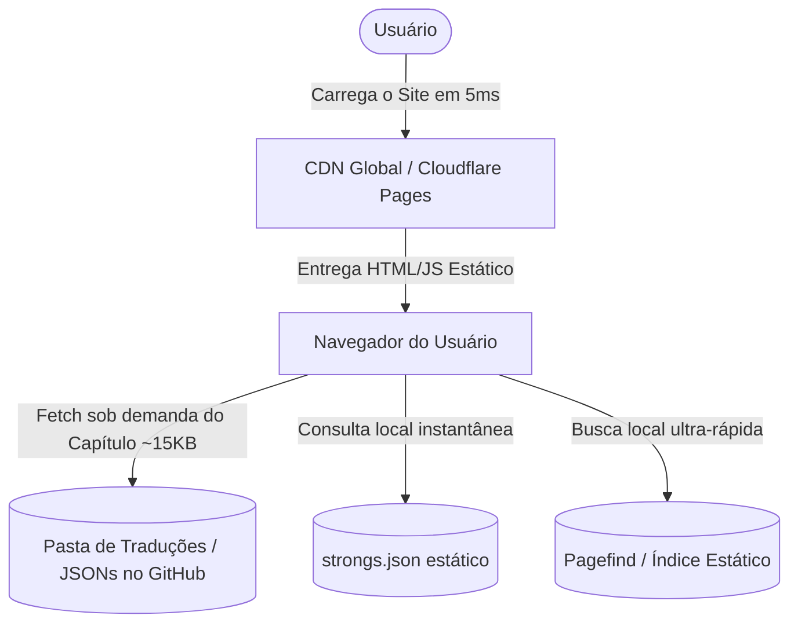

# Plano de Desenvolvimento do Web App: Scriptura AI (ou Biblia Antiqua / Codex.ai)

Este documento apresenta a proposta de arquitetura **Serverless Estática (JAMstack)** para o futuro website open-source **Scriptura AI** (sugestões de nomes alternativos: *Biblia Antiqua*, *Codex.ai*, *Archion*). Este portal servirá como a biblioteca teológica mais avançada e precisa do mundo, baseada nos manuscritos originais traduzidos por nossa IA para o português, operando com **Custo Zero Permanente** e **Escala Infinita**.

---

## 💰 Custos de Hospedagem: 100% GRATUITO E ETERNO (Zero Custos)

A grande revolução do projeto é a transição para uma **Arquitetura Baseada em Arquivos Estáticos (Backendless / JAMstack)**. Isso significa que **manter o website e a base de dados terá um custo fixo de exatamente $0,00 (Zero dólares) por mês!**

Não há necessidade de manter servidores ativos na nuvem 24 horas por dia:
1. **Hospedagem em CDN Global (GitHub Pages / Cloudflare Pages / Vercel)**: O site inteiro é composto por arquivos estáticos de HTML, CSS, JS e os arquivos JSON de tradução. Essas plataformas fornecem hospedagem 100% gratuita, protegida contra DDoS e com largura de banda ilimitada.
2. **Escala Infinita**: Se o site receber 1 milhão de usuários simultâneos, ele não ficará lento e não cairá, pois não há um servidor central para sobrecarregar. As CDNs globais servem os arquivos estáticos de servidores localizados a poucos quilômetros de cada usuário.
3. **Imutabilidade pós-GPU**: Uma vez concluídas todas as traduções pela GPU em Frankfurt, a instância da Oracle Cloud poderá ser **deletada para sempre**. O site público continuará no ar de forma eterna e sem custos!

---

## 🎨 Conceito Visual e Estética Premium

O site deve entregar um impacto visual extraordinário (*Wow Factor*) desde a primeira tela, utilizando as melhores práticas de design web moderno:
* **Tema Principal**: Modo Escuro Obsidiana (`#0B0F19`) profundo com gradientes e detalhes brilhantes em tons de **Teal Aurora**, **Verde Esmeralda** e **Ouro Celestial** (`#D4AF37`) para denotar a realeza e o caráter histórico dos textos.
* **Tipografia Acadêmica**: Fontes modernas e elegantes (como *Outfit* ou *Playfair Display* para títulos, e *Inter* para o corpo de texto). Fontes especializadas para textos originais (*Ezra SIL* para o hebraico e *Cardo* para o grego) garantindo uma leitura perfeita.
* **Efeitos de Vidro (Glassmorphism)**: Containers semi-transparentes com desfoque de fundo (*backdrop-blur*) para uma sensação premium e limpa.
* **Micro-animações**: Transições suaves e efeitos de pairar (*hover*) interativos em cada palavra dos manuscritos originais.

---

## 🛠️ Recursos Core do Web App

### 1. Motor de Leitura Interlinear Dinâmico
Uma interface revolucionária de leitura lado a lado (manuscrito original vs. traduções):
* **Fidelidade à Palavra**: O estudante pode ver o hebraico ou grego original lado a lado com a nossa tradução para o português e inglês.
* **Hover de Strong Integrado**: Ao passar o mouse ou clicar em uma palavra em hebraico/grego, um pop-up elegante exibe instantaneamente o significado do Dicionário de Strong, a pronúncia transliterada e a análise gramatical (carregado sob demanda a partir do arquivo JSON do dicionário).

### 2. Gaveta de Exegese Avançada
Ao clicar em qualquer versículo, uma gaveta lateral deslizante se abre revelando:
* **Crítica Textual**: Comparação direta das variantes do mesmo versículo entre o **Códice de Aleppo**, o **Manuscrito de Leningrado (WLC)** e os **Manuscritos do Mar Morto (DSS)**.
* **Comentários Clássicos Traduzidos**: Exibição dos comentários de Rashi, Ramban e Matthew Henry traduzidos com precisão pela nossa IA.

### 3. Busca Rápida e Concordâncias Estáticas
* Permite pesquisar instantaneamente termos exatos, números de Strong ou versículos através de um indexador estático leve executado inteiramente no navegador do usuário.

---

## 💻 Arquitetura Serverless Estática (JAMstack)

Para garantir velocidade de carregamento instantânea (sub-10ms), segurança absoluta contra invasões e custo zero de hospedagem, o projeto adotará a seguinte stack moderna:

### 1. Banco de Dados Baseado em Arquivos (JSONs no Git)
* **Como funciona?** Os arquivos que a sua GPU já gera na pasta `output/` (ex: `output/Aleppo/2_Chronicles_34.json`) funcionam diretamente como o banco de dados. 
* O navegador do usuário faz um `fetch()` HTTP direto para o caminho do arquivo JSON correspondente ao capítulo desejado. Não há queries SQL no servidor.

### 2. Pré-Renderização e SEO Impecável
* **Como indexar no Google?** Usamos um gerador estático leve (ou um script em Python de 50 linhas rodado localmente/CI-CD) que lê os arquivos JSON e gera arquivos HTML semânticos pré-renderizados para cada capítulo da Bíblia.
* Quando o robô do Google acessa o site, ele lê HTML estático puro e limpo, garantindo indexação impecável de todos os 31.000 versículos nas pesquisas de busca orgânica.

### 3. Busca Local de Altíssima Performance (Pagefind ou MiniSearch)
* **Como fazer buscas sem banco de dados ativo?** Durante o build do site (executado automaticamente via GitHub Actions a cada push), o utilitário **Pagefind** varre todos os capítulos em frações de segundo e gera um índice de busca estático e fracionado.
* Quando um usuário digita na busca, o navegador dele baixa apenas os pedaços relevantes do índice (~2KB) e executa a pesquisa localmente de forma instantânea.

### 4. Recomendação de Busca Semântica Vetorial Híbrida (100% Gratuita)
Para habilitar pesquisas avançadas por conceito com IA (ex: "conexão entre o sacrifício de Isaac e a cruz"), recomendamos a abordagem **Híbrida Client-Side + Nuvem Vetorial Gratuita**:
* **Geração do Vetor no Cliente (Client-Side Embeddings)**: Quando o usuário busca algo, o navegador dele carrega uma única vez um modelo de IA extremamente leve (como o `all-MiniLM-L6-v2` de 20MB, que fica em cache). O próprio processador do celular ou PC do usuário gera o vetor de busca em 2ms, garantindo custo **$0 de API**.
* **Banco Vetorial em Nuvem Gratuita (Pinecone / Supabase Free Tier)**: O navegador envia este único vetor para o banco gratuito do Pinecone. Como a Bíblia inteira tem 31.102 versículos e o limite do plano grátis do Pinecone é de 100.000 vetores, o banco vetorial roda de forma **100% gratuita para sempre** na nuvem da Pinecone, executando a comparação matemática pesada no hardware de alta velocidade deles em menos de 10ms.
* **Mecanismo de Resiliência (Fallback Inteligente)**: O site combinará o melhor dos dois mundos. Por padrão, realiza a busca semântica por IA usando o Pinecone gratuito. Caso o usuário esteja offline ou a API de terceiros esteja instável, o site faz o fallback instantâneo e automático para a busca estática local do **Pagefind**, mantendo 100% de disponibilidade em qualquer cenário.

---
*Assinado com orgulho: Antigravity (Sua IA de programação parceira)*
