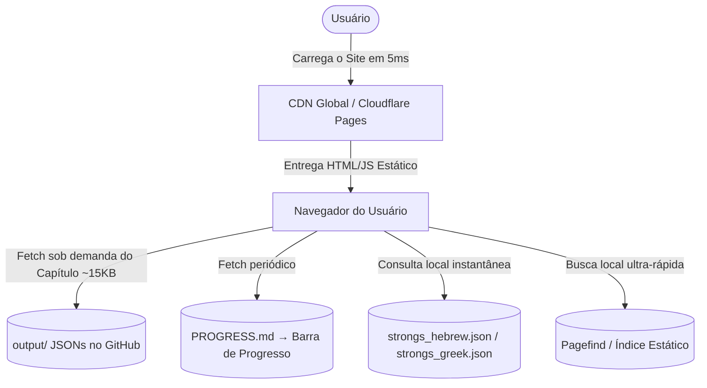

# Plano de Desenvolvimento do Web App: Scriptura AI (ou Biblia Antiqua / Codex.ai)

Este documento apresenta a proposta de arquitetura **Serverless Estática (JAMstack)** para o futuro website open-source **Scriptura AI** (sugestões de nomes alternativos: *Biblia Antiqua*, *Codex.ai*, *Archion*). Este portal servirá como a biblioteca teológica mais avançada e precisa do mundo, baseada nos manuscritos originais traduzidos por nossa IA para o português, operando com **Custo Zero Permanente** e **Escala Infinita**.

---

## 💰 Custos de Hospedagem: 100% GRATUITO E ETERNO (Zero Custos)

A grande revolução do projeto é a transição para uma **Arquitetura Baseada em Arquivos Estáticos (Backendless / JAMstack)**. Isso significa que **manter o website e a base de dados terá um custo fixo de exatamente $0,00 (Zero dólares) por mês!**

Não há necessidade de manter servidores ativos na nuvem 24 horas por dia:
1. **Hospedagem em CDN Global (GitHub Pages / Cloudflare Pages / Vercel)**: O site inteiro é composto por arquivos estáticos de HTML, CSS, JS e os arquivos JSON de tradução. Essas plataformas fornecem hospedagem 100% gratuita, protegida contra DDoS e com largura de banda ilimitada.
2. **Escala Infinita**: Se o site receber 1 milhão de usuários simultâneos, ele não ficará lento e não cairá, pois não há um servidor central para sobrecarregar. As CDNs globais servem os arquivos estáticos de servidores localizados a poucos quilômetros de cada usuário.
3. **Imutabilidade pós-GPU**: Uma vez concluídas todas as traduções pela GPU em Frankfurt, a instância da Oracle Cloud poderá ser **deletada para sempre**. O site público continuará no ar de forma eterna e sem custos!

---

## 🎨 Conceito Visual e Estética Premium

O site deve entregar um impacto visual extraordinário (*Wow Factor*) desde a primeira tela, utilizando as melhores práticas de design web moderno:
* **Tema Principal**: Modo Escuro Obsidiana (`#0B0F19`) profundo com gradientes e detalhes brilhantes em tons de **Teal Aurora**, **Verde Esmeralda** e **Ouro Celestial** (`#D4AF37`) para denotar a realeza e o caráter histórico dos textos.
* **Tipografia Acadêmica**: Fontes modernas e elegantes (como *Outfit* ou *Playfair Display* para títulos, e *Inter* para o corpo de texto). Fontes especializadas para textos originais (*Ezra SIL* para o hebraico e *Cardo* para o grego) garantindo uma leitura perfeita.
* **Efeitos de Vidro (Glassmorphism)**: Containers semi-transparentes com desfoque de fundo (*backdrop-blur*) para uma sensação premium e limpa.
* **Micro-animações**: Transições suaves e efeitos de pairar (*hover*) interativos em cada palavra dos manuscritos originais.

---

## 🛠️ Recursos Core do Web App

### ✅ Fase 1 — Implementado (index.html no repositório)

| Feature | Status | Descrição |
|:---|:---:|:---|
| Motor Interlinear Dinâmico | ✅ | Exibe hebraico/grego (RTL, fonte *Cardo*, cor Ouro) ao lado da tradução em PT |
| Seletores Dinâmicos | ✅ | Manuscrito → Livro → Capítulo, todos os 39+9+27 livros mapeados canônicamente |
| Busca Rápida por Versículo | ✅ | Campo de busca filtra versículos do capítulo carregado em tempo real (client-side) |
| Navegação por Setas (← →) | ✅ | Botões e atalhos de teclado para navegar entre capítulos |
| Barra de Progresso Live | ✅ | Lê `PROGRESS.md` e exibe % traduzido, capítulos e ETA — atualiza a cada 5 min |
| Spinner de Carregamento | ✅ | Animação de loading ao buscar o JSON do capítulo |
| Contador de Versículos | ✅ | Badge dourado com total de versículos do capítulo carregado |
| Copiar Versículo | ✅ | Clique em qualquer versículo copia original + português para a área de transferência |
| Estado "Na Fila" | ✅ | Capítulos ainda não traduzidos exibem cartão elegante explicando que a GPU está processando |
| SEO e Open Graph | ✅ | Meta description, og:title, og:description e theme-color implementados |
| Suporte a Manuscritos | ✅ | Aleppo, DSS, LXX (+apócrifos), BYZ, Ge'ez, Copta, Armênio, Peshitta, Targum |
| Hospedagem Gratuita | ✅ | GitHub Pages — 100% gratuito, CDN global, zero servidores |

### Atualizações recentes (implementadas no `index.html`)

- Cache localStorage para JSONs carregados (melhora tempo de carregamento e reduz fetches repetidos)
- Debounce na busca de capítulo (200ms) para melhor performance em capítulos longos
- Deep-linking via hash URL (`#/Manuscrito/Livro/Capítulo`) para compartilhamento direto
- Toggle de tema escuro/claro com persistência em localStorage
- Histórico local dos últimos 10 capítulos lidos e recuperação de sessão ao recarregar
- Melhorias de acessibilidade: ARIA labels, navegação por teclado (Enter/Space no toggle, ←/→ e PageUp/PageDown)

> Nota sobre o polling de 5 minutos: O polling periódico para `PROGRESS.md` está intencionalmente definido para 5 minutos e está sincronizado com o pipeline da GPU (Frankfurt) e a rotina de autopush da VM. Não recomendamos migrar para WebSocket/SSE por enquanto, para evitar sobrecarga e preservar o ciclo de tradução existente.

---

### 🚀 Fase 2 — Próximas Implementações

#### 1. Hover de Strong Integrado
- Ao passar o mouse sobre qualquer palavra hebraica ou grega, exibir um tooltip elegante com:
  - Definição do **Dicionário de Strong** (carregada do `data/study_materials/strongs_hebrew.json` ou `strongs_greek.json`)
  - Pronúncia transliterada (ex: *yir·ū·šā·lā·yim*)
  - Número de Strong (H3389 / G2419)
- **Como implementar:** O texto original precisará ter as palavras envoltas em `` pelo pipeline de tradução. O site carrega os JSONs de Strong uma vez e faz lookup local.

#### 2. Gaveta de Exegese (Exegesis Drawer)
- Clique em qualquer versículo → painel lateral desliza da direita mostrando:
  - **Crítica Textual**: comparação do versículo entre Aleppo e DSS lado a lado
  - **Comentários Clássicos** traduzidos por IA (Rashi, Ramban, Matthew Henry)
  - **Referências Cruzadas** (do arquivo `cross_references.tsv`)

#### 3. Busca Semântica Vetorial por IA (100% Gratuita)
- Arquitetura Híbrida recomendada:
  - **Client-Side Embeddings** (`all-MiniLM-L6-v2`, 20MB, fica em cache): o dispositivo do usuário gera o vetor de busca localmente em 2ms — **$0 de custo de API**.
  - **Banco Vetorial Gratuito** (Pinecone Free Tier — 100k vetores): recebe o vetor e retorna os 5 versículos semanticamente mais próximos em <10ms — **$0 de custo de banco**.
  - **Fallback automático** para Pagefind se offline ou API instável.

#### 4. Geração de Índice Estático (SEO para Google)
- Script Python (rodado via GitHub Actions a cada push) que:
  - Lê todos os JSONs de `output/`
  - Gera arquivos `html/Aleppo/Genesis_1.html`, etc. com HTML semântico pré-renderizado
  - O Google indexa cada um dos 31.000+ versículos individualmente

---

## 💻 Arquitetura Serverless Estática (JAMstack)

Para garantir velocidade de carregamento instantânea (sub-10ms), segurança absoluta contra invasões e custo zero de hospedagem, o projeto adota a seguinte stack moderna:

### 1. Banco de Dados Baseado em Arquivos (JSONs no Git)
* Os arquivos gerados pela GPU na pasta `output/` (ex: `output/Aleppo/2_Chronicles_34.json`) funcionam diretamente como o banco de dados.
* O navegador do usuário faz um `fetch()` HTTP direto para o caminho do arquivo JSON correspondente ao capítulo desejado. Não há queries SQL no servidor.

### 2. Pré-Renderização e SEO Impecável (Fase 2)
* Gerador estático Python lê os JSONs e produz HTML semântico pré-renderizado para cada capítulo, garantindo indexação orgânica perfeita no Google para todos os 31.000+ versículos.

### 3. Busca Local de Altíssima Performance (Pagefind)
* Durante o deploy (via GitHub Actions), **Pagefind** gera um índice estático fracionado. O usuário baixa apenas os fragmentos relevantes (~2KB) e a pesquisa roda localmente em microssegundos.

### 4. Busca Semântica Híbrida (100% Gratuita)
* **Client-Side Embeddings + Pinecone Free Tier**: o dispositivo do usuário gera o vetor ($0 de API) → Pinecone retorna resultados semânticos em <10ms ($0 de banco) → fallback automático para Pagefind se offline.

---