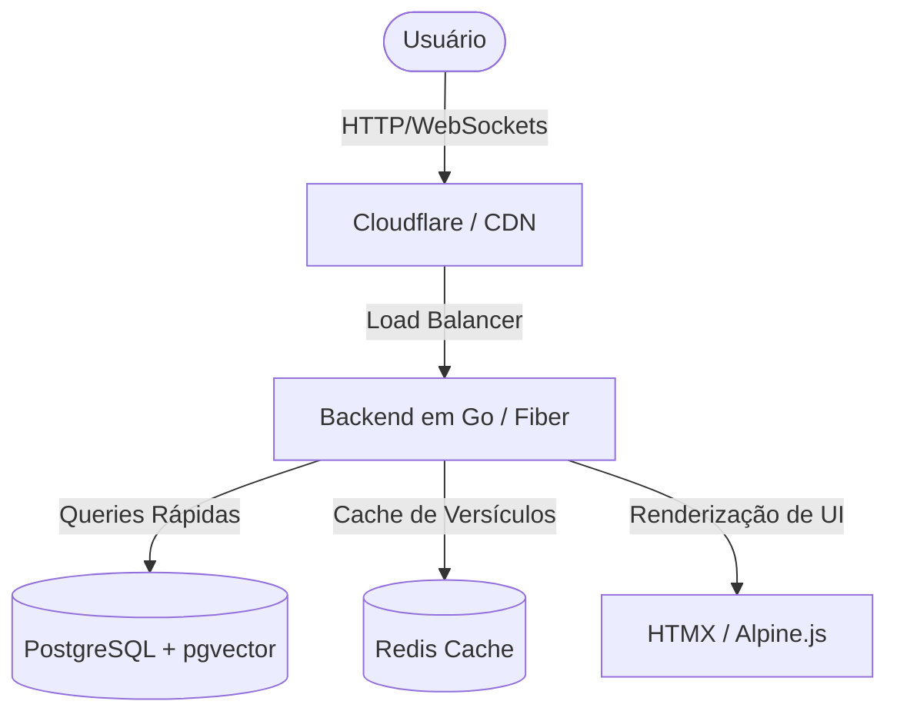

# Plano de Desenvolvimento do Web App: Scriptura AI (ou Biblia Antiqua / Codex.ai)

Este documento apresenta a proposta arquitetônica e de design para o futuro website open-source **Scriptura AI** (sugestões de nomes alternativos: *Biblia Antiqua*, *Codex.ai*, *Archion*), que servirá como o portal oficial para a biblioteca teológica mais avançada e precisa do mundo, baseada nos manuscritos originais traduzidos por nossa IA para o português.

---

## 💰 Custos de Hospedagem: 100% GRATUITO (Always Free)

Uma das maiores vantagens da nossa arquitetura de software de alta performance (Go + PostgreSQL + HTMX) é que **manter o website e a base de dados terá um custo de exatamente $0,00 (Zero dólares)!** 

Não é necessário pagar servidores caros. A estrutura será hospedada na camada **Always Free** (Sempre Gratuita) da Oracle Cloud e protegida por CDN gratuita:
1. **Máquina Virtual Oracle A1 (Sempre Gratuita)**: A Oracle fornece gratuitamente máquinas virtuais ARM de até **4 CPUs Ampere e 24 GB de RAM**, com 200 GB de armazenamento em disco. Um executável compilado em **Go** consome cerca de apenas 15 MB de RAM e tem uma velocidade inacreditável. Essa máquina gratuita pode processar facilmente milhões de requisições mensais!
2. **Cloudflare CDN (Camada Gratuita)**: Como os textos bíblicos e comentários são dados estáticos (não mudam em tempo real), a Cloudflare fará o cache completo de 98% das páginas de leitura em seus servidores globais de borda. O tráfego nem chegará a sobrecarregar nossa máquina virtual, garantindo velocidade de carregamento instantânea (sub-100ms), proteção contra ataques DDoS e custo zero!

---

## 🎨 Conceito Visual e Estética Premium

O site deve causar um impacto visual extraordinário (*Wow Factor*) desde a primeira tela, utilizando as melhores práticas de design web moderno:
* **Tema Principal**: Modo Escuro Obsidiana (`#0B0F19`) profundo com gradientes e detalhes brilhantes em tons de **Teal Aurora**, **Verde Esmeralda** e **Ouro Celestial** (`#D4AF37`) para denotar a realeza e o caráter histórico dos textos.
* **Tipografia Acadêmica**: Fontes modernas e elegantes (como *Outfit* ou *Playfair Display* para títulos, e *Inter* para o corpo de texto). Fontes especializadas para textos originais (*Ezra SIL* para o hebraico e *Cardo* para o grego) garantindo uma leitura perfeita.
* **Efeitos de Vidro (Glassmorphism)**: Containers semi-transparentes com desfoque de fundo (*backdrop-blur*) para uma sensação premium e limpa.
* **Micro-animações**: Transições suaves e efeitos de pairar (*hover*) interativos em cada palavra dos manuscritos originais.

---

## 🛠️ Recursos Core do Web App

### 1. Motor de Leitura Interlinear Dinâmico
Uma interface revolucionária de leitura lado a lado (manuscrito original vs. traduções):
* **Fidelidade à Palavra**: O estudante pode ver o hebraico ou grego original lado a lado com a nossa tradução para o português e inglês.
* **Hover de Strong Integrado**: Ao passar o mouse ou clicar em uma palavra em hebraico/grego, um pop-up elegante exibe instantaneamente o significado do Dicionário de Strong, a pronúncia transliterada e a análise gramatical.

### 2. Painel Lateral de Exegese Avançada
Ao clicar em qualquer versículo, uma gaveta lateral deslizante se abre revelando:
* **Crítica Textual**: Comparação direta das variantes do mesmo versículo entre o **Códice de Aleppo**, o **Manuscrito de Leningrado (WLC)** e os **Manuscritos do Mar Morto (DSS)**.
* **Comentários Clássicos Traduzidos**: Exibição dos comentários de Rashi, Ramban e Matthew Henry traduzidos com precisão pela nossa IA.
* **Referências Cruzadas Dinâmicas**: Visualização gráfica e navegável das conexões do TSK (Treasury of Scripture Knowledge).

### 3. Busca Semântica Teológica
Um mecanismo de busca inteligente alimentado por IA e estruturado por tópicos (usando o Índice de Nave):
* Permite pesquisar conceitos teológicos complexos (ex: "Aliança", "Redenção") e obter instantaneamente todos os versículos, comentários e artigos relacionados.

---

## 💻 Arquitetura de Software e Stack Recomendada

Para garantir velocidade na escala de sub-milissegundos, consumo mínimo de recursos na nuvem e facilidade de manutenção por ser open-source, sugerimos uma stack moderna de alta performance:

### 1. Backend: Go (Golang) + Fiber ou Gin
* **Por que Go?** O Go é incrivelmente rápido, compila em um único executável binário, consome apenas alguns megabytes de RAM e gerencia milhares de requisições simultâneas sem esforço.
* **Banco de Dados**: **PostgreSQL** com a extensão `pgvector` para buscas semânticas vetoriais baseadas em IA sobre o conteúdo dos comentários.

### 2. Frontend: HTMX + Alpine.js + TailwindCSS
* **Por que esta abordagem (REST-first)?** Reduz a complexidade de frameworks gigantes (como React/Next.js) permitindo interações dinâmicas ultravelozes em tempo real diretamente a partir do HTML fornecido pelo backend em Go.
* Excelente para SEO e indexação de páginas de versículos nos mecanismos de busca do Google.
