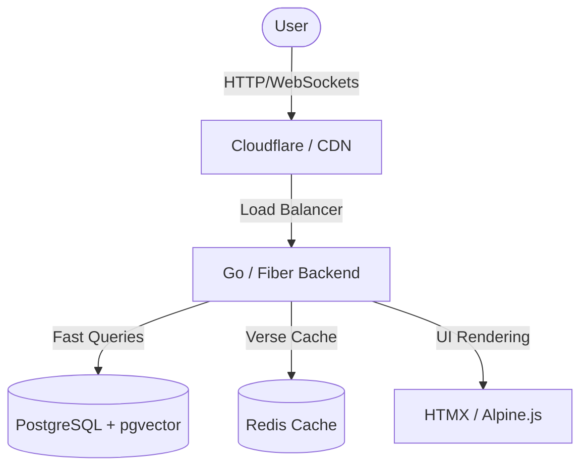

# Web App Development Plan: Scriptura AI (or Biblia Antiqua / Codex.ai)

This document presents the architectural and design proposal for the future open-source website **Scriptura AI** (alternative names: *Biblia Antiqua*, *Codex.ai*, *Archion*), which will serve as the official portal for the most advanced and accurate theological library in the world, powered by our AI-translated original manuscripts into Portuguese.

---

## 💰 Hosting Cost: 100% FREE (Always Free)

One of the greatest benefits of our high-performance software architecture (Go + PostgreSQL + HTMX) is that **hosting and maintaining this website and database will cost exactly $0.00 (Zero dollars) per month!**

There is no need for expensive server bills. The entire application will run on Oracle Cloud's **Always Free** tier and be cached via a free CDN:
1. **Oracle A1 VM (Always Free)**: Oracle provides high-performance ARM virtual machines with up to **4 CPUs and 24 GB of RAM**, along with 200 GB of free storage. A compiled Go binary is incredibly lightweight (consuming only ~15 MB of RAM) and incredibly fast, meaning this free machine can easily process millions of page views per month.
2. **Cloudflare CDN (Free Tier)**: Since biblical texts and commentaries are static data, Cloudflare will cache 98% of all chapter/verse reading pages. Request traffic will rarely hit our VM, guaranteeing sub-100ms loading speeds globally, robust DDoS protection, and absolute zero server costs!

---

## 🎨 Visual Concept and Premium Aesthetics

The website should deliver an extraordinary visual impact (*Wow Factor*) from the very first screen, utilizing the best practices of modern web design:
* **Core Theme**: Deep Obsidian Dark Mode (`#0B0F19`) accented by glowing gradients of **Aurora Teal**, **Emerald Green**, and **Celestial Gold** (`#D4AF37`) to denote the royalty and historical grandeur of the texts.
* **Academic Typography**: Sleek, modern typography (such as *Outfit* or *Playfair Display* for headings, and *Inter* for body text). Specialized fonts for original languages (*Ezra SIL* for Hebrew and *Cardo* for Greek) to ensure optimal legibility.
* **Glassmorphism**: Semi-transparent, blur-backed containers (*backdrop-blur*) for a premium, clean, and futuristic feel.
* **Micro-animations**: Smooth transitions and interactive hover effects over every word of the original manuscripts.

---

## 🛠️ Core Features of the Web App

### 1. Dynamic Interlinear Reading Engine
A revolutionary side-by-side reading interface (original manuscript vs. translations):
* **Fidelity to the Word**: Students can read the original Hebrew or Greek side-by-side with our highly accurate Portuguese and English translations.
* **Integrated Strong's Hover**: Hovering over or clicking any Hebrew/Greek word instantly displays its Strong's Concordance definition, transliterated pronunciation, and grammatical parsing in an elegant tooltip.

### 2. Advanced Exegesis Drawer
Clicking on any verse slides open a detailed right-hand panel showing:
* **Textual Criticism**: Direct variant comparisons of the same verse across the **Aleppo Codex**, the **Leningrad Codex (WLC)**, and the **Dead Sea Scrolls (DSS)**.
* **Translated Classical Commentaries**: Fully translated, precise commentaries by Rashi, Ramban, and Matthew Henry, generated by our AI pipeline.
* **Dynamic Cross-References**: A visual, navigable network of biblical connections based on the Treasury of Scripture Knowledge (TSK).

### 3. Semantic Theological Search
An AI-powered, topic-structured search engine (leveraging Nave's Topical Index):
* Enables users to search for complex theological concepts (e.g., "Covenant", "Redemption") and instantly fetch all related verses, commentaries, and articles.

---

## 💻 Software Architecture and Recommended Tech Stack

To ensure sub-millisecond query speed, minimal cloud resource consumption, and ease of maintenance as an open-source project, we recommend a high-performance modern stack:

### 1. Backend: Go (Golang) + Fiber or Gin
* **Why Go?** Go is incredibly fast, compiles into a single static binary, consumes very few megabytes of RAM, and handles thousands of concurrent connections effortlessly.
* **Database**: **PostgreSQL** with the `pgvector` extension to run semantic vector searches over all commentary text.

### 2. Frontend: HTMX + Alpine.js + TailwindCSS
* **Why this REST-first approach?** It completely bypasses the complexity of heavy JS frameworks (like React/Next.js), enabling highly responsive real-time interactions rendered directly from the Go backend.
* Excellent for SEO, ensuring fast page load times and optimal indexing of every single verse on search engines like Google.
