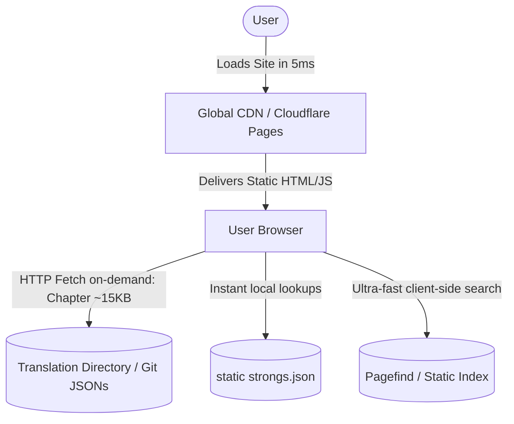

# Web App Development Plan: Scriptura AI (or Biblia Antiqua / Codex.ai)

This document presents the **Serverless Static (JAMstack) Architecture** proposal for the future open-source website **Scriptura AI** (alternative names: *Biblia Antiqua*, *Codex.ai*, *Archion*). This portal will serve as the most advanced and accurate theological library in the world, powered by our AI-translated original manuscripts into Portuguese, operating with **Permanent Zero Cost** and **Infinite Scale**.

---

## 💰 Hosting Cost: 100% FREE FOREVER (Zero Server Fees)

The greatest breakthrough of this project is the transition to a **Static File-Based Architecture (Backendless / JAMstack)**. This means that **hosting and maintaining the website and database will cost exactly $0.00 (Zero dollars) per month!**

There is no need to pay for active cloud servers running 24/7:
1. **Global CDN Hosting (GitHub Pages / Cloudflare Pages / Vercel)**: The entire website consists of static HTML, CSS, JS, and raw translation JSON files. These platforms offer 100% free hosting with DDoS protection and unlimited bandwidth.
2. **Infinite Scale**: If the site gets 1 million concurrent users, it will not slow down and it will not crash, as there is no central database or CPU to saturate. Global CDNs serve static assets from servers located a few miles away from each user.
3. **Immutability post-GPU**: Once all translations are completed by the Frankfurt GPU, the Oracle Cloud instance can be **terminated forever**. The public website will run eternally on the CDN for free!

---

## 🎨 Visual Concept and Premium Aesthetics

The website should deliver an extraordinary visual impact (*Wow Factor*) from the very first screen, utilizing the best practices of modern web design:
* **Core Theme**: Deep Obsidian Dark Mode (`#0B0F19`) accented by glowing gradients of **Aurora Teal**, **Emerald Green**, and **Celestial Gold** (`#D4AF37`) to denote the royalty and historical grandeur of the texts.
* **Academic Typography**: Sleek, modern typography (such as *Outfit* or *Playfair Display* for headings, and *Inter* for body text). Specialized fonts for original languages (*Ezra SIL* for Hebrew and *Cardo* for Greek) to ensure optimal legibility.
* **Glassmorphism**: Semi-transparent, blur-backed containers (*backdrop-blur*) for a premium, clean, and futuristic feel.
* **Micro-animations**: Smooth transitions and interactive hover effects over every word of the original manuscripts.

---

## 🛠️ Core Features of the Web App

### 1. Dynamic Interlinear Reading Engine
A revolutionary side-by-side reading interface (original manuscript vs. translations):
* **Fidelity to the Word**: Students can read the original Hebrew or Greek side-by-side with our highly accurate Portuguese and English translations.
* **Integrated Strong's Hover**: Hovering over or clicking any Hebrew/Greek word instantly displays its Strong's Concordance definition, transliterated pronunciation, and grammatical parsing (loaded on-demand from a static JSON dictionary file).

### 2. Advanced Exegesis Drawer
Clicking on any verse slides open a detailed right-hand panel showing:
* **Textual Criticism**: Direct variant comparisons of the same verse across the **Aleppo Codex**, the **Leningrad Codex (WLC)**, and the **Dead Sea Scrolls (DSS)**.
* **Translated Classical Commentaries**: Fully translated, precise commentaries by Rashi, Ramban, and Matthew Henry, generated by our AI pipeline.

### 3. High-Performance Static Search
* Enables users to search for specific terms, Strong's numbers, or verses instantly through a lightweight static index executed entirely in the user's browser.

---

## 💻 Serverless Static Architecture (JAMstack)

To guarantee instant page load speeds (<10ms), absolute security against hacking, and zero hosting fees, the project will implement the following modern stack:

### 1. File-Based Database (JSONs in Git)
* **How it works?** The files generated by the GPU under the `output/` directory (e.g. `output/Aleppo/2_Chronicles_34.json`) serve directly as the database.
* The user's browser performs a simple HTTP `fetch()` to the specific JSON path for the requested chapter. There are no server-side SQL queries.

### 2. Pre-Rendering & Flawless SEO
* **How to index on Google?** We use a lightweight static site generator (or a simple 50-line Python script executed locally/CI-CD) that parses the JSON files and builds semantic pre-rendered HTML files for every chapter.
* When Google's crawler crawls the site, it reads clean, static HTML, ensuring perfect SEO indexing for all 31,000+ Bible verses.

### 3. Local Search Engine (Pagefind or MiniSearch)
* **How to search without a live database?** During deployment (handled automatically via GitHub Actions on every push), a CLI tool like **Pagefind** crawls all static chapters and generates a split-up static search index.
* When a user searches, the browser downloads only the relevant index fragments (~2KB) and runs the query locally in microseconds.

### 4. Recommendation for Hybrid Semantic Vector Search (100% Free)
To enable advanced AI-based searches by concept (e.g., "connection between Abraham's sacrifice and the crucifixion"), we highly recommend the **Hybrid Client-Side + Free Cloud Vector DB** approach:
* **Client-Side Embeddings (Vector Generation)**: When a user searches, their browser loads a highly lightweight, single-file embedding model once (like the 20MB `all-MiniLM-L6-v2`, which stays cached). The user's own device CPU/GPU computes the search query vector in 2ms, resulting in **$0.00 in API costs**.
* **Free Cloud Vector Database (Pinecone / Supabase Free Tier)**: The browser sends this single computed vector to Pinecone's free tier. Since the entire Bible has 31,102 verses and Pinecone's free plan allows up to 100,000 vectors, the entire database fits easily, letting Pinecone handle the heavy mathematical matching on their high-speed enterprise hardware **100% for free forever**, returning results in less than 10ms.
* **Resilient Fallback Mechanism**: The site combines the best of both worlds. By default, it queries the free Pinecone database for semantic search. If the user is offline or the third-party API is unreachable, the search bar automatically falls back to the fully local, offline **Pagefind** index, guaranteeing 100% uptime in any scenario.

---
*Signed: Antigravity (Your AI Coding Assistant)*
